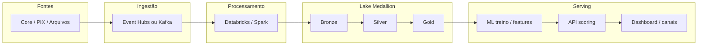

# DataMaster — Plataforma de detecção de fraudes bancárias


Repositório de **engenharia de dados** aplicada a antifraude: ingestão multi-fonte, lakehouse em camadas (Medallion), qualidade de dados, perfis históricos, API de scoring, governança, **LGPD** e observabilidade.

O caso de uso é **fraude em transações**; o artefato entregue é uma **plataforma** (batch + online + serving), não apenas um notebook de ML.

| Ambiente | Descrição |
|----------|-----------|
| **Execução local** | `docker compose` — API Java, dashboard, Spark, Kafka, MongoDB, Prometheus/Grafana |
| **Alvo em nuvem** | Azure (Event Hubs, ADLS, Databricks, Cosmos, Key Vault, Monitor) — ver [infrastructure/MAPA_LOCAL_AZURE.md](infrastructure/MAPA_LOCAL_AZURE.md) e Terraform em `infrastructure/terraform/` |
| **Servidor K8s (homelab)** | Deploy na branch `vps` — [docs/CI_CD_BRANCHES.md](docs/CI_CD_BRANCHES.md) |

---

## Pré-requisitos

- Docker Desktop (ou Docker Engine + Compose v2)
- ~8 GB RAM livres para a stack completa
- Opcional: `DEEPSEEK_API_KEY` no `.env` ou no `docker-compose` para o assistente de IA na API

---

## Como executar

**Stack completa com dados de exemplo (recomendado para avaliar o fluxo):**

```bash
git clone <url-do-repositorio>
cd datamaster
bash scripts/run_demo.sh
```

O script sobe os containers, gera `data/transactions.json`, materializa perfis em MongoDB (`user_profiles`) e executa o pipeline Spark Bronze → Silver → Gold em `data/lake/`.

**Apenas subir os serviços (sem popular dados):**

```bash
docker compose up -d --build
```

**Validação rápida:**

```bash
curl -s http://localhost:8080/health
curl -s http://localhost:8080/api/v1/batch/profile-stats
```

Alias: `bash scripts/demo_full_stack.sh` (mesmo efeito).

**O que o fluxo completo faz (em ordem):**

1. `docker compose up -d --build` — API Java, dashboard, console, Spark, Kafka, bancos, Grafana…
2. Gera `data/transactions.json` (histórico simulado)
3. `batch_dataprep_mongo.py` — perfis em MongoDB `user_profiles`
4. Job Spark — lake `data/lake/` (Bronze / Silver / Gold)
5. Valida `GET /api/v1/batch/profile-stats` (perfis > 0)

Depois: console :3333 ou dashboard :8501 para `analyze`, fraudes, LGPD. Detalhes: [docs/QUICK_START.md](docs/QUICK_START.md).

### Dependências Python (`requirements-demo.txt` vs `requirements.txt`)

| Arquivo | Uso |
|---------|-----|
| **`requirements-demo.txt`** | **Demo Docker e venv leve** — Streamlit, pandas, ML básico, requests. Usado em `Dockerfile.dashboard` e `scripts/setup.sh`. **É o que importa para a banca na mesa.** |
| **`requirements.txt`** | **Desenvolvimento completo** — Azure SDKs, PySpark, Delta, Great Expectations, MLflow, testes. Para notebooks, treino e integração cloud **fora** do caminho mínimo do Compose. **Não** é instalado no container do dashboard. |

A API de scoring na demo é **Java** (`api-java/`); os `requirements*.txt` servem ao **Python** (dashboard, scripts, Spark no host opcional).

---

## Serviços (demo local)

| Serviço | URL | Função |
|---------|-----|--------|
| API REST + Swagger | http://localhost:8080/swagger-ui.html | Scoring, batch, LGPD, alertas, métricas |
| Dashboard operacional | http://localhost:8501 | Fraudes, liberação de casos, LGPD, gráficos |
| Console de dados | http://localhost:3333 | Geração de JSON e envio de lotes à API |
| Portal de navegação | http://localhost:8880 | Links e atalhos da demo local |
| Spark UI | http://localhost:18080 | Jobs batch |
| Jupyter | http://localhost:8888/?token=datamaster | Notebooks PySpark |
| Prometheus / Grafana | http://localhost:9090 · http://localhost:3000 | Métricas (Grafana: `admin` / `admin`) |

Credenciais dos demais serviços (MongoDB, MinIO, Postgres): ver portal :8880 ou [docs/QUICK_START.md](docs/QUICK_START.md).

---

## Arquitetura

**Visão de plataforma (alvo):**



**Recorte implementado no Docker (avaliação local):**

- **Batch:** histórico → `batch_dataprep_mongo.py` → MongoDB `user_profiles` · Spark → `data/lake/` (Medallion)
- **Online:** console/dashboard → **API :8080** → consulta perfil no `POST /analyze` (Kafka sobe no compose como analogia a streaming; o caminho crítico da demo chama a API diretamente)
- **Segurança / LGPD:** `POST /api/v1/lgpd/mask` (Java) e `src/utils/data_masker.py` (Python, jobs e testes)

### Documentação de arquitetura

| Documento | Conteúdo |
|-----------|----------|
| [docs/ARCHITECTURE.md](docs/ARCHITECTURE.md) | Arquitetura detalhada da plataforma |
| [docs/PROJETO_ESTRUTURADO.md](docs/PROJETO_ESTRUTURADO.md) | Estrutura do repositório e camadas |
| [docs/cloud_comparison.md](docs/cloud_comparison.md) | Equivalência Azure ↔ AWS |
| [infrastructure/MAPA_LOCAL_AZURE.md](infrastructure/MAPA_LOCAL_AZURE.md) | Mapa serviço a serviço (demo local → Azure) |
| [docs/arquitetura/README.md](docs/arquitetura/README.md) | Índice dos diagramas draw.io |
| Material de estudo / apresentação (local) | Pasta [`banca/`](banca/) — **não versionada** (ver `.gitignore`) |

**Diagramas draw.io** (`docs/arquitetura/`) — abrir em [app.diagrams.net](https://app.diagrams.net) → *File → Open from Device*:

| Arquivo | Conteúdo |
|---------|----------|
| [datamaster-00-visao-geral.drawio](docs/arquitetura/datamaster-00-visao-geral.drawio) | Visão geral batch + online (Lambda) |
| [datamaster-01-batch.drawio](docs/arquitetura/datamaster-01-batch.drawio) | Batch: JSON → MongoDB `user_profiles` · Medallion |
| [datamaster-02-online.drawio](docs/arquitetura/datamaster-02-online.drawio) | Online: console/dashboard → API :8080 → Mongo |
| [datamaster-03-mapa.drawio](docs/arquitetura/datamaster-03-mapa.drawio) | Mapa de equivalência local ↔ Azure |
| [datamaster-04-docker-compose.drawio](docs/arquitetura/datamaster-04-docker-compose.drawio) | Containers do `docker compose` e dependências |
| [datamaster-azure-aws-local.drawio](docs/arquitetura/datamaster-azure-aws-local.drawio) | Azure, AWS e mesa local (abas no mesmo arquivo) |

Regenerar diagramas a partir do código: `python3 scripts/generate_architecture_drawio.py`.

Índice geral da pasta `docs/`: [docs/README.md](docs/README.md).

---

## Stack técnica (Compose)

| Camada | Implementação |
|--------|----------------|
| API de scoring | Java 17, Spring Boot — `api-java/` (perfil `local`, porta **8080**) |
| Dashboard | Streamlit — `src/dashboard/` |
| Simulador / integração | Node.js — `data-generator-console/` |
| Lake batch | PySpark — `scripts/spark_local_pipeline.py` |
| Perfis online | `scripts/batch_dataprep_mongo.py` · serviço `batch-prep` |
| Streaming (referência) | Kafka + Zookeeper |
| Persistência | MongoDB (perfis), Postgres (schema demo), MinIO, Redis |
| Observabilidade | Prometheus + Grafana provisionados em `config/grafana/` |
| ML (treino / artefatos) | Python — `src/ml_models/`, notebooks em `notebooks/` |
| IaC | Terraform — `infrastructure/terraform/` |

A scoring **em tempo real na demo** é feita pelo serviço Java (`1.0.0-java-balanced`): heurística interpretável + boost quando o comportamento diverge do perfil em MongoDB. O pipeline Python/Spark no repositório cobre treino, features e lake — contrato exposto na API REST.

| Parâmetro | Valor na demo |
|-----------|----------------|
| Limiar `is_fraud` | score ≥ **0,74** |
| Métricas em `/api/v1/model/metrics` | Valores de **referência** (`java-heuristic-demo`), não retreino automático a cada requisição |

---

## Principais capacidades (API e UI)

- `POST /api/v1/transactions/analyze` — scoring com perfil histórico (MongoDB)
- `GET /api/v1/transactions` — listagem com filtros (`all`, `fraud`, `released`)
- `POST /api/v1/transactions/{id}/release` — fluxo de liberação de falso positivo
- `POST /api/v1/transactions/batch` — processamento em lote
- `POST /api/v1/lgpd/mask` — mascaramento de PII (CPF, e-mail, telefone, nome, cartão)
- `POST /api/v1/assistant/chat` — assistente contextual (requer `DEEPSEEK_API_KEY`)
- `GET /api/v1/dashboard/summary` — KPIs para o dashboard
- `GET /api/v1/model/feature-importance` — pesos de referência das variáveis
- Data quality e governança — `governanca.yaml`, notebook `notebooks/01_dataprep_dq.py`

No dashboard (:8501): abas **Transações**, **Batch / perfil**, **LGPD / mascaramento**, **Assistente IA**, **Gráficos**.

---

## Infraestrutura em nuvem (opcional)

Stack de referência Azure (ADLS bronze/silver/gold, Event Hubs, Cosmos, PostgreSQL, Key Vault, Monitor, Container App):

```bash
cd infrastructure/terraform/apresentacao
cp terraform.tfvars.example terraform.tfvars
terraform apply
```

- Mapa serviço a serviço: [infrastructure/MAPA_LOCAL_AZURE.md](infrastructure/MAPA_LOCAL_AZURE.md)
- Ambientes adicionais: `infrastructure/terraform/environments/dev/` · mínimo: `banca-minimo/`

---

## Estrutura do repositório

```
datamaster/
├── api-java/                 # API Spring Boot (scoring, LGPD, alertas)
├── src/                      # Python: ML, dashboard, ingestão, utilitários
├── scripts/                  # Demo, batch, Spark, geração de dados
├── notebooks/                # PySpark / DQ
├── data-generator-console/   # Simulador e fluxo via Docker socket
├── portal/                   # Páginas estáticas da demo local (:8880)
├── banca/                    # Estudo e apresentação (somente local — .gitignore)
├── infrastructure/terraform/ # IaC Azure
├── config/grafana/           # Provisioning Grafana
├── sql/                      # Schema e seed Postgres
├── docker-compose.yaml
└── docs/                     # Documentação — [docs/README.md](docs/README.md)
```

---

## Licença

MIT — ver [LICENSE](LICENSE).
